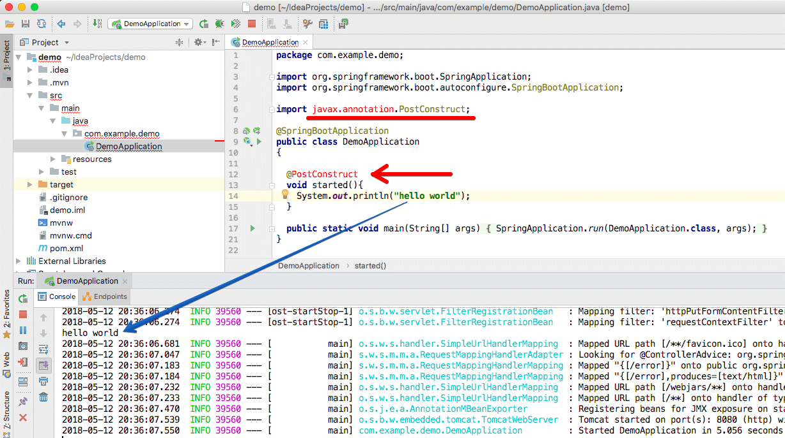

Community > IntelliJ IDEA Users: 
https://intellij-support.jetbrains.com/hc/en-us/community/posts/360000542464-IDEA-marks-the-import-of-class-form-the-Java-10-module-as-an-error-but-run-application-without-any-errors
  
Video: 
https://youtu.be/15qm3cvjvYE
  
Screenshot: 

